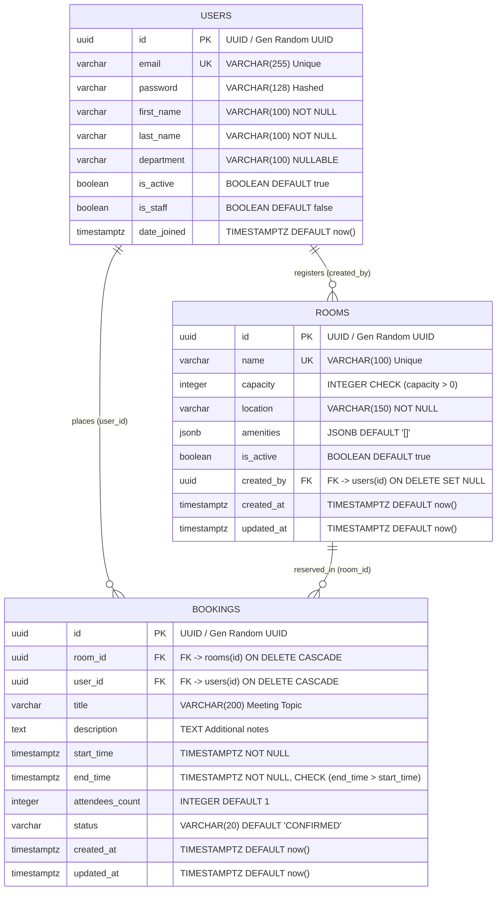

# PostgreSQL Database Schema Specification

**Project:** Event & Meeting Room Scheduler  
**Stack:** React · Django REST Framework (DRF) · PostgreSQL · JWT Authentication  
**Contributors:**  
- **Jerin** (Room & Asset Management Module)  
- **Srilaxmi** (Booking Engine & Conflict Validation Module)  
- **Prashanth** (User Dashboard, Auth & Reservation Lifecycle Module)  

---

## 1. Executive Summary & Architecture Alignment

The **Event & Meeting Room Scheduler** is built around three core business domains assigned across the team:
1. **User Identity & Lifecycle (Prashanth):** Manages user accounts, credentials, departments, JWT authentication, and user reservation history.
2. **Room & Asset Catalog (Jerin):** Manages physical and virtual meeting spaces, capacities, locations, active statuses, and searchable JSONB amenity sets.
3. **Booking Engine & Conflict Prevention (Srilaxmi):** Connects users to rooms over specific time intervals, enforces strict slot-conflict validation at both database and application tiers, and handles reservation lifecycles (`CONFIRMED` → `CANCELLED`).

### Relational Alignment & Foreign Keys
```
  ┌──────────────────────────┐                   ┌──────────────────────────┐
  │          users           │                   │          rooms           │
  │   (Owner: Prashanth)     │                   │      (Owner: Jerin)      │
  ├──────────────────────────┤                   ├──────────────────────────┤
  │ PK  id (UUID)            │◄──────┐   ┌──────►│ PK  id (UUID)            │
  │     email (UNIQUE)       │       │   │       │     name (UNIQUE)        │
  │     first_name           │       │   │       │     capacity (> 0)       │
  │     last_name            │       │   │       │     location             │
  │     department           │       │   │       │     amenities (JSONB)    │
  └──────────────────────────┘       │   │       │     is_active (BOOLEAN)  │
                                     │   │       └──────────────────────────┘
                               ┌─────┴───┴──────┐
                               │    bookings    │
                               │(Owner: Srilaxmi│
                               ├────────────────┤
                               │ PK  id (UUID)  │
                               │ FK  room_id    │
                               │ FK  user_id    │
                               │     start_time │
                               │     end_time   │
                               │     status     │
                               │     created_at │
                               └────────────────┘
```

---

## 2. Entity-Relationship (ER) Diagram



---

## 3. Detailed Data Dictionary

### 3.1 `users` Table (Owner: Prashanth)
- **Purpose:** Stores user profiles, authentication credentials, and department affiliations. Serves as the identity anchor across the entire application.

| Column Name | Data Type | Nullable | Default | Constraints / Description |
|---|---|---|---|---|
| `id` | `UUID` | No | `gen_random_uuid()` | **Primary Key** |
| `email` | `VARCHAR(255)` | No | — | **Unique**, Valid email, normalized lowercase |
| `password` | `VARCHAR(128)` | No | — | PBKDF2/Argon2 encrypted password hash |
| `first_name` | `VARCHAR(100)` | No | — | User first name |
| `last_name` | `VARCHAR(100)` | No | — | User last name |
| `department` | `VARCHAR(100)` | Yes | `NULL` | Team or department (e.g., Engineering, Marketing) |
| `is_active` | `BOOLEAN` | No | `TRUE` | Whether the user account is active |
| `is_staff` | `BOOLEAN` | No | `FALSE` | Admin portal access permission |
| `is_superuser` | `BOOLEAN` | No | `FALSE` | Superuser flag |
| `date_joined` | `TIMESTAMPTZ` | No | `CURRENT_TIMESTAMP` | Account creation timestamp |
| `last_login` | `TIMESTAMPTZ` | Yes | `NULL` | Last authentication timestamp |

---

### 3.2 `rooms` Table (Owner: Jerin)
- **Purpose:** Manages available meeting spaces, occupant capacities, physical locations, and amenity specifications.

| Column Name | Data Type | Nullable | Default | Constraints / Description |
|---|---|---|---|---|
| `id` | `UUID` | No | `gen_random_uuid()` | **Primary Key** |
| `name` | `VARCHAR(100)` | No | — | **Unique**, Room name (e.g., "Boardroom Alpha") |
| `capacity` | `INTEGER` | No | — | **Check Constraint:** `CHECK (capacity > 0)` |
| `location` | `VARCHAR(150)` | No | — | Building, floor, or zone (e.g., "Building B, 3rd Floor") |
| `amenities` | `JSONB` | No | `'[]'::jsonb` | JSON list of amenities (e.g., `["Projector", "Whiteboard", "VC"]`) |
| `is_active` | `BOOLEAN` | No | `TRUE` | Whether the room is currently open for booking |
| `created_by` | `UUID` | Yes | `NULL` | **Foreign Key:** `REFERENCES users(id) ON DELETE SET NULL` |
| `created_at` | `TIMESTAMPTZ` | No | `CURRENT_TIMESTAMP` | Record creation timestamp |
| `updated_at` | `TIMESTAMPTZ` | No | `CURRENT_TIMESTAMP` | Record last updated timestamp |

---

### 3.3 `bookings` Table (Owner: Srilaxmi)
- **Purpose:** Stores reservation records linking a user to a meeting room over a designated time slot. Enforces schedule overlap validation.

| Column Name | Data Type | Nullable | Default | Constraints / Description |
|---|---|---|---|---|
| `id` | `UUID` | No | `gen_random_uuid()` | **Primary Key** |
| `room_id` | `UUID` | No | — | **Foreign Key:** `REFERENCES rooms(id) ON DELETE CASCADE` |
| `user_id` | `UUID` | No | — | **Foreign Key:** `REFERENCES users(id) ON DELETE CASCADE` |
| `title` | `VARCHAR(200)` | No | — | Meeting title / purpose |
| `description` | `TEXT` | Yes | `''` | Detailed agenda / notes |
| `start_time` | `TIMESTAMPTZ` | No | — | Reservation start time (UTC) |
| `end_time` | `TIMESTAMPTZ` | No | — | Reservation end time (UTC). **CHECK:** `end_time > start_time` |
| `attendees_count` | `INTEGER` | No | `1` | Expected count of participants |
| `status` | `VARCHAR(20)` | No | `'CONFIRMED'` | Values: `'CONFIRMED'`, `'CANCELLED'` (or `'PENDING'`, `'COMPLETED'`) |
| `created_at` | `TIMESTAMPTZ` | No | `CURRENT_TIMESTAMP` | Timestamp when reservation was created |
| `updated_at` | `TIMESTAMPTZ` | No | `CURRENT_TIMESTAMP` | Timestamp when reservation was last modified |

---

## 4. PostgreSQL DDL Implementation (SQL Script)

```sql
-- Enable necessary PostgreSQL extensions
CREATE EXTENSION IF NOT EXISTS "uuid-ossp";
CREATE EXTENSION IF NOT EXISTS "btree_gist";

-- ============================================================================
-- 1. USERS TABLE (Prashanth Assignment)
-- ============================================================================
CREATE TABLE IF NOT EXISTS users (
    id UUID PRIMARY KEY DEFAULT gen_random_uuid(),
    email VARCHAR(255) NOT NULL UNIQUE,
    password VARCHAR(128) NOT NULL,
    first_name VARCHAR(100) NOT NULL,
    last_name VARCHAR(100) NOT NULL,
    department VARCHAR(100) NULL,
    is_active BOOLEAN NOT NULL DEFAULT TRUE,
    is_staff BOOLEAN NOT NULL DEFAULT FALSE,
    is_superuser BOOLEAN NOT NULL DEFAULT FALSE,
    date_joined TIMESTAMPTZ NOT NULL DEFAULT CURRENT_TIMESTAMP,
    last_login TIMESTAMPTZ NULL
);

CREATE INDEX IF NOT EXISTS idx_users_email ON users(email);
CREATE INDEX IF NOT EXISTS idx_users_department ON users(department);

-- ============================================================================
-- 2. ROOMS TABLE (Jerin Assignment)
-- ============================================================================
CREATE TABLE IF NOT EXISTS rooms (
    id UUID PRIMARY KEY DEFAULT gen_random_uuid(),
    name VARCHAR(100) NOT NULL UNIQUE,
    capacity INTEGER NOT NULL,
    location VARCHAR(150) NOT NULL,
    amenities JSONB NOT NULL DEFAULT '[]'::jsonb,
    is_active BOOLEAN NOT NULL DEFAULT TRUE,
    created_by UUID NULL REFERENCES users(id) ON DELETE SET NULL,
    created_at TIMESTAMPTZ NOT NULL DEFAULT CURRENT_TIMESTAMP,
    updated_at TIMESTAMPTZ NOT NULL DEFAULT CURRENT_TIMESTAMP,
    CONSTRAINT room_capacity_gt_0 CHECK (capacity > 0)
);

CREATE INDEX IF NOT EXISTS idx_rooms_name ON rooms(name);
CREATE INDEX IF NOT EXISTS idx_rooms_is_active ON rooms(is_active);
CREATE INDEX IF NOT EXISTS idx_rooms_capacity ON rooms(capacity);
CREATE INDEX IF NOT EXISTS idx_rooms_amenities_gin ON rooms USING GIN (amenities);

-- ============================================================================
-- 3. BOOKINGS TABLE (Srilaxmi Assignment)
-- ============================================================================
CREATE TABLE IF NOT EXISTS bookings (
    id UUID PRIMARY KEY DEFAULT gen_random_uuid(),
    room_id UUID NOT NULL REFERENCES rooms(id) ON DELETE CASCADE,
    user_id UUID NOT NULL REFERENCES users(id) ON DELETE CASCADE,
    title VARCHAR(200) NOT NULL,
    description TEXT NOT NULL DEFAULT '',
    start_time TIMESTAMPTZ NOT NULL,
    end_time TIMESTAMPTZ NOT NULL,
    attendees_count INTEGER NOT NULL DEFAULT 1,
    status VARCHAR(20) NOT NULL DEFAULT 'CONFIRMED',
    created_at TIMESTAMPTZ NOT NULL DEFAULT CURRENT_TIMESTAMP,
    updated_at TIMESTAMPTZ NOT NULL DEFAULT CURRENT_TIMESTAMP,
    CONSTRAINT booking_time_order_valid CHECK (end_time > start_time),
    CONSTRAINT booking_status_choices CHECK (status IN ('CONFIRMED', 'CANCELLED', 'PENDING', 'COMPLETED'))
);

-- Essential Performance Indexes
CREATE INDEX IF NOT EXISTS idx_bookings_room_time ON bookings(room_id, start_time, end_time);
CREATE INDEX IF NOT EXISTS idx_bookings_user_id ON bookings(user_id);
CREATE INDEX IF NOT EXISTS idx_bookings_status ON bookings(status);
CREATE INDEX IF NOT EXISTS idx_bookings_start_time ON bookings(start_time);

-- ============================================================================
-- 4. HARD DATABASE-LEVEL CONFLICT PREVENTION (GiST Exclusion Constraint)
-- Requires btree_gist extension. Prevents any double-booking at DB level!
-- ============================================================================
ALTER TABLE bookings 
ADD CONSTRAINT prevent_overlapping_room_bookings 
EXCLUDE USING gist (
    room_id WITH =,
    tstzrange(start_time, end_time) WITH &&
)
WHERE (status != 'CANCELLED');
```

---

## 5. Conflict Validation Engine & Overlap Detection

### 5.1 Mathematical Overlap Definition
As defined in Srilaxmi's assignment, two bookings for the same room overlap if:
$$\text{Overlap} \iff \neg (\text{end\_time} \le \text{new\_start} \lor \text{start\_time} \ge \text{new\_end})$$

By De Morgan's Law, this is simplified for SQL and ORM querying as:
$$\text{Overlap} \iff (\text{start\_time} < \text{new\_end}) \land (\text{end\_time} > \text{new\_start})$$

### 5.2 Multi-Layer Concurrency Defense
1. **Layer 1: Database Exclusion Constraint (PostgreSQL):**  
   The `prevent_overlapping_room_bookings` GiST exclusion constraint guarantees atomicity and zero race conditions under high concurrency.
2. **Layer 2: Django ORM Validation (`select_for_update`):**  
   In `BookingViewSet` / `BookingSerializer`, wrap validation inside `transaction.atomic()` with a database query:
   ```python
   conflicts = Booking.objects.filter(
       room_id=room.id,
       start_time__lt=new_end,
       end_time__gt=new_start,
   ).exclude(status='CANCELLED')
   ```
3. **Layer 3: Standard HTTP 409 Conflict Response:**  
   If an overlap is detected, return HTTP 409:
   ```json
   {
     "error": {
       "code": "BOOKING_CONFLICT",
       "message": "The requested room is already booked for the selected time window.",
       "details": {
         "room_id": "3fa85f64-5717-4562-b3fc-2c963f66afa6",
         "conflict_start": "2026-09-20T10:00:00Z",
         "conflict_end": "2026-09-20T11:00:00Z"
       }
     }
   }
   ```

---

## 6. Django REST Framework ORM Models

### 6.1 Users Model (`backend/config/users/models.py`)
```python
import uuid
from django.contrib.auth.models import AbstractBaseUser, PermissionsMixin
from django.db import models
from .managers import UserManager

class User(AbstractBaseUser, PermissionsMixin):
    id = models.UUIDField(primary_key=True, default=uuid.uuid4, editable=False)
    email = models.EmailField(max_length=255, unique=True)
    first_name = models.CharField(max_length=100)
    last_name = models.CharField(max_length=100)
    department = models.CharField(max_length=100, null=True, blank=True)

    is_active = models.BooleanField(default=True)
    is_staff = models.BooleanField(default=False)
    date_joined = models.DateTimeField(auto_now_add=True)

    objects = UserManager()

    USERNAME_FIELD = "email"
    REQUIRED_FIELDS = ["first_name", "last_name"]

    class Meta:
        db_table = "users"
        ordering = ["-date_joined"]

    def __str__(self):
        return self.email

    @property
    def full_name(self):
        return f"{self.first_name} {self.last_name}".strip()
```

### 6.2 Rooms Model (`backend/config/rooms/models.py`)
```python
import uuid
from django.conf import settings
from django.core.validators import MinValueValidator
from django.db import models

class Room(models.Model):
    id = models.UUIDField(primary_key=True, default=uuid.uuid4, editable=False)
    name = models.CharField(max_length=100, unique=True, help_text="Unique room name")
    capacity = models.PositiveIntegerField(
        validators=[MinValueValidator(1)],
        help_text="Maximum room capacity (> 0)"
    )
    location = models.CharField(max_length=150, help_text="Physical or virtual location")
    amenities = models.JSONField(default=list, blank=True, help_text="List of amenities")
    is_active = models.BooleanField(default=True, help_text="Active booking status")

    created_by = models.ForeignKey(
        settings.AUTH_USER_MODEL,
        on_delete=models.SET_NULL,
        null=True,
        blank=True,
        related_name="created_rooms"
    )
    created_at = models.DateTimeField(auto_now_add=True)
    updated_at = models.DateTimeField(auto_now=True)

    class Meta:
        db_table = "rooms"
        ordering = ["name"]
        indexes = [
            models.Index(fields=["name"]),
            models.Index(fields=["is_active"]),
            models.Index(fields=["capacity"]),
        ]
        constraints = [
            models.CheckConstraint(
                condition=models.Q(capacity__gt=0),
                name="room_capacity_gt_0"
            )
        ]

    def __str__(self):
        return f"{self.name} ({self.location}) - Capacity: {self.capacity}"
```

### 6.3 Bookings Model (`backend/config/bookings/models.py`)
```python
import uuid
from django.conf import settings
from django.core.exceptions import ValidationError
from django.db import models

class Booking(models.Model):
    STATUS_CHOICES = [
        ('CONFIRMED', 'Confirmed'),
        ('CANCELLED', 'Cancelled'),
        ('PENDING', 'Pending'),
        ('COMPLETED', 'Completed'),
    ]

    id = models.UUIDField(primary_key=True, default=uuid.uuid4, editable=False)
    room = models.ForeignKey(
        'rooms.Room',
        on_delete=models.CASCADE,
        related_name='bookings',
        help_text="The meeting room reserved"
    )
    user = models.ForeignKey(
        settings.AUTH_USER_MODEL,
        on_delete=models.CASCADE,
        related_name='bookings',
        help_text="User who made the reservation"
    )
    title = models.CharField(max_length=200, help_text="Meeting title / purpose")
    description = models.TextField(blank=True, default='', help_text="Meeting agenda or details")
    start_time = models.DateTimeField(help_text="Start time with timezone")
    end_time = models.DateTimeField(help_text="End time with timezone")
    attendees_count = models.PositiveIntegerField(default=1, help_text="Estimated attendees")
    status = models.CharField(max_length=20, choices=STATUS_CHOICES, default='CONFIRMED')
    created_at = models.DateTimeField(auto_now_add=True)
    updated_at = models.DateTimeField(auto_now=True)

    class Meta:
        db_table = "bookings"
        ordering = ['start_time']
        indexes = [
            models.Index(fields=['room', 'start_time', 'end_time']),
            models.Index(fields=['user', 'start_time']),
            models.Index(fields=['status']),
        ]
        constraints = [
            models.CheckConstraint(
                condition=models.Q(end_time__gt=models.F('start_time')),
                name="booking_end_time_after_start_time"
            )
        ]

    def clean(self):
        super().clean()
        if self.start_time and self.end_time:
            if self.end_time <= self.start_time:
                raise ValidationError({"end_time": "End time must be after start time."})

            if self.status != 'CANCELLED' and hasattr(self, 'room') and self.room:
                conflicts = Booking.objects.filter(
                    room=self.room,
                    start_time__lt=self.end_time,
                    end_time__gt=self.start_time
                ).exclude(status='CANCELLED')

                if self.pk:
                    conflicts = conflicts.exclude(pk=self.pk)

                if conflicts.exists():
                    conflict = conflicts.first()
                    raise ValidationError({
                        "room": f"Conflict detected: Room '{self.room.name}' is already reserved from "
                                f"{conflict.start_time.strftime('%Y-%m-%d %H:%M')} to "
                                f"{conflict.end_time.strftime('%H:%M')}."
                    })

    def save(self, *args, **kwargs):
        self.full_clean()
        super().save(*args, **kwargs)

    def __str__(self):
        return f"{self.title} - {self.room.name} ({self.start_time.strftime('%Y-%m-%d %H:%M')} - {self.end_time.strftime('%H:%M')})"
```

---

## 7. Audit & Alignment Recommendations for the Team

1. **FK Alignment in `bookings` Module (Srilaxmi & Jerin):**
   - In the initial codebase prototype (`backend/config/bookings/models.py`), a temporary `room_name = CharField(...)` was used.
   - **Recommendation:** Refactor `room_name` to `room = models.ForeignKey('rooms.Room', on_delete=models.CASCADE, related_name='bookings')`. This aligns directly with Jerin's and Srilaxmi's specification sheets and enables relational integrity (`ON DELETE CASCADE`).

2. **Explicit Table Naming:**
   - `rooms` specifies `db_table = "rooms"`.
   - `users` specifies `db_table = "users"`.
   - Add `db_table = "bookings"` inside `Booking.Meta` so PostgreSQL matches the specification table name instead of defaulting to `bookings_booking`.

3. **Status Transitions (Prashanth & Srilaxmi):**
   - Bookings are created by default with status `CONFIRMED`.
   - Prashanth's `/api/bookings/{id}/cancel/` endpoint transitions the state to `CANCELLED`.
   - Cancelled bookings are immediately excluded by both the database exclusion constraint and the ORM overlap check, releasing the room slot in real-time.
